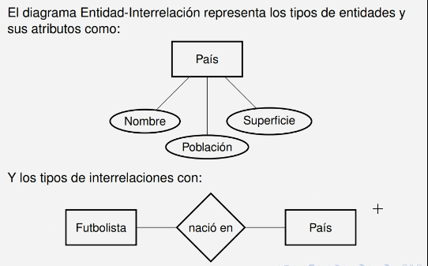

# Modelo entidad-interrelación (ER)

Se basa en entidades, relaciones y atributos.

- **Tipo de Entidad**: es un tipo o clase de objeto.
- **Entidad**: es una instancia de un tipo de entidad.
- **Atributo**: es una propiedad o característica que describe a una entidad.
- **Tipo de interrelación**: es la definicion de un conjunto de relaciones o asociaciones similares entre dos o más tipos de entidades. Se puede tener varias interrelaciones distintas entre los mismos tipos de entidades. Por ejemplo entre futbolista y pais, se puede tener una interrelación de nacionalidad y otra de país donde juega.

## Diferencia entre relación e interrelación

La confusión proviene de que la traducción de relation y relationship al español es relación. Sin embargo, en el contexto de las bases de datos, una relación es un conjunto de datos que se almacena en una tabla, mientras que una interrelación es una asociación entre dos o más tablas.

## Diagrama entidad-interrelación

Es una representación gráfica de las entidades, relaciones y atributos de un sistema.

- **Entidad**: se representa con un rectángulo.
- **Atributo**: se representa con un óvalo.
- **Relación**: se representa con un rombo.

### Ejemplo

## Atributos

Cada entidad tendrá **valores** particulares para cada uno de sus atributos del tipo de entidad al que corresponde.

El **dominio** de un atributo es el conjunto de valores que puede tomar.

En ciertos casos se puede permitir que un atributo tenga un valor nulo, lo que significa que no se conoce el valor del atributo. Se lo llama **NULL** y en este modelo cualquier atributo puede ser nulo.

### Atributos simples y compuestos

- **Simple**: no se puede dividir en partes más pequeñas.
- **Compuesto**: se puede dividir en partes más pequeñas. Normalmente se refiere a un conjunto de atributos simples.

### Atributos multivaluados y monovaluados

- **Monovaluado**: tiene un solo valor.
- **Multivaluado**: puede tener varios valores. Se representa con un óvalo doble.

### Atributos almacenados y derivados

- **Almacenado**: se almacena en la base de datos.
- **Derivado**: se calcula a partir de otros atributos. Se representa con un óvalo punteado.

## Entidades

Al conjunto de ocurrencias o instancias de un determinado tipo de entidad en un estado determinado de la base de datos se lo llama **conjunto de entidades** de un tipo de entidad.

Es decir que un conjunto de entidades es un conjunto de objetos de un mismo tipo de entidad, que reprentan un al conjunto de ocurrencias de un tipo de entidad en un instante determinado.

### Restricción de unicidad

Todo tipo de entidad debe tener un atributo o conjunto de atributos que permitan identificar de manera única a cada entidad.

Este atributo o conjunto de atributos se llama **atributo clave** o **identificador único**.

En el modelo entidad-interrelación, el atributo clave se subraya.

El subconjunto de atributos debe ser **minimal** es decir que no se puede eliminar ningún atributo sin perder la unicidad.

En este modelo se debe elegir un subconjunto de atributos como clave, aunque existan otros atributos que también sean únicos. En este caso y en este modelo, se debe elegir uno de los subconjuntos de atributos como clave y NO se puede poner la restricción para ambos subconjuntos. Ejemplo (padrón y tipo y numero de documento).

## Interrelaciones

Es una asociación entre dos o más entidades.

### Aridad o grado de una interrelación

Es la cantidad de tipos de entidades que coparticipan en la interrelación.

- **Unaria** o **Recursiva**: un solo tipo de entidad.
- **Binaira**: dos tipos de entidades.
- **n-aria**: más de dos tipos de entidades.

### Cardinalidad de una interrelación

Es el número de ocurrencias de una entidad que pueden estar asociadas con un número de ocurrencias de otra entidad.

En interrelaciones binarias, la cardinalidad se puede clasificar en:

- **1:1**: una entidad de un tipo está asociada con una entidad de otro tipo.
- **1:N** o **N:1**: una entidad de un tipo está asociada con varias entidades de otro tipo.
- **M:N**: varias entidades de un tipo están asociadas con varias entidades de otro tipo.

### Restricciones de participación

Es la cantidad mínima de ocurrencias de una entidad que pueden estar asociadas con una ocurrencia de otra entidad.

- **Participación total** o **Dependencia existencial**: todas las entidades de un tipo deben estar asociadas con al menos una entidad de otro tipo.
- **Parcial**: no todas las entidades de un tipo deben estar asociadas con al menos una entidad de otro tipo.

### Restricciones estructurales

Cuando tenemos una restricción de cardinalidad y participación, se la llama restricción estructural.

Se representa con (min, max) en el diagrama donde min se denota la participación y max la cardinalidad del tipo de entidad en una interrelación dada.

### Atributos de interrelación

Son atributos que describen la interrelación en sí misma. Normalmente ocurren cuando la interrelación es de muchos a muchos, pero esto no es una restricción y se puede aplicar a cualquier tipo de interrelación.

### Restricción de unicidad de interrelaciones

Al igual que las entidades, también debemos identificar de manrea única a las interrelaciones. Para esto se pueden utilizar los atributos claves de las entidades que participan en la interrelación.

Dependiendo de la cardinalidad de la interrelación, se puede tener uno o varios atributos claves que identifiquen univoamente a la interrelación.

### Limitación del modelo para identificar relaciones

En un caso que se quiera identificar muchas relaciones univocamente, por ejemplo cursadas de un alumno a una materia a lo largo de distintos cuatrimestres, no se puede usar un atributo de la interelación como clave. Se debe introducir una entidad adicional intermedia que represente la relación entre las dos entidades. Por ejemplo, una entidad que represente la cursada.

## Cuando representar un dato como atributo o entidad

Normalmente si se desea tipificar y tener control sobre los valres que puede tomar un atributo, se lo representa como entidad. Por ejemplo, el genero de un libro donde se puede tener una entidad genero con los valores de genero que se pueden tomar. Si no se desea tener control sobre los valores que puede tomar un atributo, se lo representa como atributo. Por ejemplo, el nombre de un libro.

Usar entidades permite evitar errores de tipeo y tener control sobre los valores que puede tomar un atributo. Sin embargo, también puede complicar el modelo y hacerlo más difícil de entender. Por lo tanto, se debe tener en cuenta la complejidad del modelo y la necesidad de control sobre los valores que puede tomar un atributo.

Otra forma es en terminos semánticos, si el atributo es un objeto en sí mismo, se lo representa como entidad. Por ejemplo, el genero de un libro es un objeto en sí mismo y se lo representa como entidad. Si el atributo es una propiedad de un objeto, se lo representa como atributo. Por ejemplo, la cantidad de páginas de un libro es una propiedad del libro y se lo representa como atributo.

## Modelado de datos

No existe un modelo de datos perfecto, ya que cada modelo tiene sus ventajas y desventajas. Por lo tanto, se debe elegir el modelo que mejor se adapte a las necesidades del sistema. Siempre y cuando las decisiones sean coherentes y se justifiquen, cualquier modelo es válido.

### Pasos para el modelado de datos

1. Identificar los tipos de entidades.
2. Identificar los atributos de cada tipo de entidad.
3. Identificar los tipos de interrelaciones.
4. Identificar los atributos clave de cada tipo de entidad.
5. Identificar las restricciones estructurales.

## Modelo ER avanzado

El modelo por si mismo no es suficiente para representar de una forma verosiímil la realidad. Por lo tanto, se pueden agregar propiedades adicionales al modelo para hacerlo completo y más realista.

## Entidades débiles y fuertes

Cuando una entidad depende de otra entidad para ser identificada, se la llama **entidad débil**. Por ejemplo, un numero de habitación depende de un hotel para ser identificado. La clave de una entidad débil se compone de la clave de la entidad fuerte y de uno o más atributos de la entidad débil. Estos atributos se llaman **discriminanates** y se subrayan con una línea punteada.

Una relación débil necesariamente requiere de una relación con una participación total.

La **entidad debil** se representa con un doble rectángulo. Por otro lado la **entidad fuerte** se representa con un rectángulo simple y es aquella que necesita de una entidad débil para ser identificada. Además se debe representar doble rombo para la relación entre la entidad fuerte y la entidad débil.

## Entidades n-arias

Cuando una interrelación involucra más de dos tipos de entidades, se la llama **interrelación n-aria**. Se representa con un rombo con más de dos líneas.

### Interrelaciones ternarias

Lo más común es que las interrelaciones n-arias sean ternarias. En este caso, se representa con un rombo con tres líneas. Esto significa que la interrelación involucra a tres tipos de entidades que tienen una relación única entre sí.

Por ejemplo un cantante, una ronda, y un jurado en un concurso de canto, se puede tener una interrelación ternaria que represente una puntación de un cantante en una ronda por un jurado específico.

Cuando se quiere especificar la restricción estructural de una interrelación ternaria, se debe especificar la cardinalidad y la participación sobre una entidad en función de las otras dos entidades. Es decir cuantas ocurrencias de una entidad pueden estar asociadas con un número de ocurrencias de las otras dos entidades.

Cuando elegimos una ternaria tenemos que saber que no podemos establecer restricciona de a dos entidades, sino que debemos establecer restricciones de a tres entidades.

Por otro lado lo más normal es que las relaciónes ternarias tengan una participación parcial, es decir que no todas las combinaciones de dos entidades deben estar asociadas con al menos una entidad de la tercera entidad.

En el caso de que un profesor de una materia en un turno dado, sería imposible que exista al menos un turno por cada profesor en alguna materia para todos los turnos, por eso normalmente al menos en casos muy específicos, se establece una participación parcial (minimo 0).

## Agregación

Como no se puede representar una interrelación entre entidades y/o interrelaciones, se puede utilizar la agregación para definir nuevas entidades que representen la relación entre entidades.

Por ejemplo si se quiere represnetar una participación de un cantante en una ronda de un concurso de canto, se puede crear una entidad que represente la participación del cantante en la ronda. Este a su vez puede tener una interrelación con un jurado que puntúa al cantante.

## Generalización y especialización

Es una tecnica que permite representar la relación entre entidades. Se puede repesentar una generalización de una serie de entidades en una entidad general o una especialización de una entidad general en una serie de entidades especializadas.

La clave de la generalización es suficiente para identificar a todas las entidades especializadas. Por otro lado, la clave de la especialización es la clave de la entidad general. Aunque se puede tener atributos adicionales en las entidades especializadas, estos atributos no pueden ser claves.

Toda entidad especializada debe corresponderse necesariamente con una y sola una entidad general.

### Completitud

- **Total**: todas las entidades de la entidad general deben ser de una entidad especializada.
- **Parcial**: no todas las entidades de la entidad general deben ser de una entidad especializada.

### Superposición

- **Superpuesta**: una entidad puede ser de más de una entidad especializada.
- **Disjunta**: una entidad no puede ser de más de una entidad especializada.

## Unión

A diferencia de la generalización y especialización, la unión permite que una entidad especializada exista sin necesidad de que exista una entidad general. Es decir que una entidad especializada puede existir sin necesidad de que exista una entidad general.

Esto significa que ahora tenemos una entidad padre y distintos subtipos de entidades que pueden existir sin necesidad de que exista la entidad padre.

Esto implica que la clave de la entidad general no es suficiente para identificar a las entidades especializadas y que las mismas deben tener una clave propia.

Ahora el tipo de entidad padre es subclase de los subtipos de entidades (que son la superclase).

### Completitud y superposición

Igual que en la generalización y especialización, se puede tener completitud total o parcial y superposición superpuesta o disjunta.
