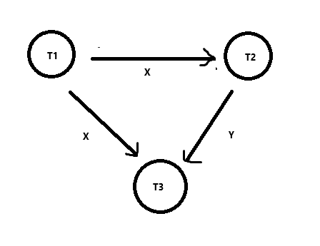

# Modelo de parcial 2

## Procesamiento de consultas 1

La empresa multinacional BueyStar quiere obtener los clientes de dos países, utilizando la siguiente consulta:

- Clientes(id_cliente, nombre, email, pais, fecha_creacion, ...) PK = {id_cliente}

```sql
SELECT * FROM Clientes WHERE pais = "Argentina" OR pais = "Uzbekistan";
```

En la tabla existe un índice de clustering por la columna pais con una altura de 2, y además se cuenta con un histograma de los 3 valores más frecuentes y su cantidad de filas.

Se pide:

1. Calcule, indicando el costo en acceso a bloques de disco para cada estrategia, si conviene utilizar el índice para resolver la consulta o si conviene efectuar un file scan de la tabla.
2. Estime la cardinalidad del resultado de la selección en términos de cantidad de filas.

Considere para sus cálculos la siguiente información de catálogo:

**Clientes:**

- n(Clientes) = 1.200.000
- B(Clientes) = 400.000
- V(pais, Clientes) = 83
- H(I(pais, Clientes)) = 2

**Histograma:**

- "Mexico": 250.000 filas
- "Argentina": 200.000 filas
- "India": 150.000 filas

### Procesamiento de consultas 1-1

En este caso como tenemos un OR, para usar un índice, debemos asegurarnos que ambas condiciones puedan ser indexadas. En este caso, ambas condiciones son sobre la columna `pais`, por lo que el índice puede ser utilizado.

En este caso, la estrategia será hacer un "Index Scan" por ambas condiciones y luego hacer un "Union" de los resultados. Esto nos servirá siempre y cuando sea más baraato que hacer un "File Scan" de la tabla.

```plaintext
INDICE CLUSTERING
n(ARG) = 200.000
F(Clientes) = n(Clientes) / B(Clientes) = 1.200.000 / 400.000 = 3

C(s_arg_i) = Height(I(país,Clientes)) + ⌈n(ARG) / F(Cliente)⌉
= 2 + ⌈200.000 / 3⌉
= 2 + ⌈66.666,6⌉
= 2 + 66.667
= 66.669

SIN ÍNDICE
C(s_arg_f) = B(Clientes)
= 400.000

Como C(s_arg_i) < C(s_arg_f), conviene usar el índice.
```

Mismo cálculo para Uzbekistan.

```plaintext
INDICE CLUSTERING
n(UZB) = (n(Clientes) - n(ARG) - n(MEX) - n(IND)) / (V(país,Clientes) - 3)
= (1.200.000 - 200.000 - 250.000 - 150.000) / (83 - 3)
= 600.000 / 80
= 7.500

C(s_uzb_i) = Height(I(país,Clientes)) + ⌈n(UZB) / F(Cliente)⌉
= 2 + ⌈7.500 / 3⌉
= 2 + ⌈2.500⌉
= 2 + 2.500
= 2.502

SIN ÍNDICE
C(s_uzb_f) = B(Clientes)
= 400.000

Como C(s_uzb_i) < C(s_uzb_f), conviene usar el índice.
```

Luego calculamos el costo de la unión de ambos resultados. Que al hacer pipelining y al ser dos conjuntos totalmente disjuntos, no habrá costo adicional por hacer la unión. Lo que si debemos tener memoria suficiente para ir guardando los resultados parciales, es decir 2 bloques para cada país y un bloque para el resultado final + los bloques que se necesiten para hacer el "Index Scan".

```plaintext
C(s_arg_i UNION s_uzb_i) = C(s_arg_i) + C(s_uzb_i)
= 66.669 + 2.502
= 69.171
```

### Procesamiento de consultas 1-2

Para calcular la cardinalidad del resultado, debemos tener en cuenta que estamos haciendo una selección por un país u otro, por lo que la cardinalidad del resultado será la suma de las cardinalidades de cada país ya que la cardinalidad de la intersección es nula.

```plaintext
n(ARG UNION UZB) = n(ARG) + n(UZB)
= 200.000 + 7.500
= 207.500
```

## Procesamiento de consultas 2

La plataforma de envios Lentti guarda la información de los pedidos de sus usuarios en las siguientes tablas:

- Usuarios(id_usuario, email, direccion, ultimo_login) PK = {id_usuario}
- Pedidos(id_pedido, id_usuario, fecha, tipo) PK = {id_pedido}

Por un problema de auditoria, precisa saber en qué fechas un usuario hizo pedidos urgentes con la siguiente consulta SQL:

```sql
SELECT fecha FROM Usuarios u, Pedidos p
WHERE p.id_usuario = u.id_usuario
AND u.email = "immcnabb@nfl.com" AND p.tipo = "URGENTE";
```

La tabla de usuarios cuenta con un índice por id_usuario (I1) y otro por email (I2). La tabla de pedidos cuenta con un índice por id_usuario (I3) y otro por tipo (I4). Todos son índices secundarios.

Se pide:

1. Genere un árbol de consulta para una resolucion eficiente de la consulta.
2. Calcule el costo de resolver la consulta con el plan que surge de dicho árbol de consulta.

Para resolver ambos items se cuenta con la siguiente metadata:

**Usuarios:**

- n(Usuarios) = 80.000
- B(Usuarios) = 2.000
- V(email, Usuarios) = 80.000
- H(I1) = 4
- H(I2) = 4

**Pedidos:**

- n(Pedidos) = 320.000
- B(Pedidos) = 32.000
- V(id_usuario, Pedidos) = 80.000
- V(tipo, Pedidos) = 10
- H(I3) = 4
- H(I4) = 1

### Procesamiento de consultas 2-1

Como yo lo resolvería es:

```plaintext
USER = σ {email = "immcnabb@nfl.com"} (Usuarios)
ID_USUARIO = π {id_usuario} USER (OPCIONAL en este caso)
PEDIDOS_USUARIO = ID_USUARIO ⋈ {pedidos.id_usuario = usuarios.id_usuario} Pedidos
URGENTES = σ {tipo = "URGENTE"} PEDIDOS_USUARIO
FECHAS = π {fecha} URGENTES
```


### Procesamiento de consultas 2-2

Para calcular el costo de la consulta, primero calculamos el costo de cada operación:

```plaintext
C(USER) = H(I2) + ⌈n(Usuarios) / V(email, Usuarios)⌉
= 4 + ⌈80.000 / 80.000⌉
= 4 + ⌈1⌉
= 4 + 1
= 5

C(ID_USUARIO) = 0 (la proyección se hace en memoria)

LOOP CON ÚNICO ÍNDICE
C(PEDIDOS_USUARIO) = n(ID_USUARIO) * ( Height(I(id_usuario, Pedidos)) + ⌈B(Pedidos) / V(id_usuario, Pedidos)⌉ )
= 1 * ( 4 + ⌈320.000 / 80.000⌉ )
= 4 + ⌈4⌉
= 4 + 4
= 8

C(URGENTES) = 0 (la selección se hace en memoria)
C(FECHAS) = 0 (la proyección se hace en memoria)

C(TOTAL) = C(USER) + C(ID_USUARIO) + C(PEDIDOS_USUARIO) + C(URGENTES) + C(FECHAS)
= 5 + 0 + 8 + 0 + 0
= 13
```

## NoSQL - MongoDB

El sisito de publicaciones científicas "Paper View" guarda en una base de datos Mongo los datos de los papaes publicados con la siguiente estructura de documento:

```json
{
    "_id" : 10910355903998401931,
    "titulo" : "Base de Datos, de la B a la D",
    "autores" : ["Mariano Villani","Alejandro John"],
    "categoria" : "Informatica",
    "puntaje" : 4.2
}
```

Lo que buscan es obtener información sobre los autores de papers que pertenezvan a la categoría "Informatica": para cada autor que haya publicado al menos 10 de esos papers, quieren conocer la cantidad de papers publicados y el promedio de puntaje entre ellos, con la siguiente estructura:

```json
{
    "autor" : "Mariano Villani",
    "papers" : 30,
    "promedio" : 5.3
}
```

Se pide:

1. Escriba una consulta en MongoDB que devuelva el listado según las condiciones indicadas.
2. Explique por qué atributos puede shardearse la colección de papers para que la resolución de la consulta sea lo más distribuida posible. En caso de que haya atributos por los que shardear haga la resolución menos distribuida, indique cuales son con una breve explicación del por qué.

### NoSQL - MongoDB 1

```js
db.papers.aggregate([
    { $match: { categoria: "Informatica" } },
    { $unwind: "$autores" },
    { $group: 
        {
            _id: "$autores",
            cantidad: {
                $sum: 1 
            },
            promedio_puntaje: {
                $avg: "$puntaje"
            }
        }
    },
    { $match: { cantidad: { $gte: 10 } } },
    { $project: { autor: "$_id", cantidad: 1, promedio: 1, _id: 0 } }
])
```

### NoSQL - MongoDB 2

Si shardeamos por la categoría (informática) la consulta no resultará distribuida ya que buscamos docuemntos que estén en la misma categoría, por lo que sharder por esa categoría no nos va a ayudar a distribuir la carga de trabajo sino a concentrarla en un único shard.

Por otro lado sería muy eficiente shardar por el autor ya que la consulta se agrupa por autor y esto se podría resolver de forma local. Ahora esto es imposible ya que no se puede shardar por un campo de tipo array.

Por lo que la única opción que nos queda es shardear por el título, el puntaje o el id del documento. De esta forma, el procesamiento inicial de la consulta, se distribuirá entre los distintos shards y luego se hará un merge de los resultados parciales en un nodo central con muchos menos datos.

## Neo4j

La famosa red social LinkedOut está sufriendo un ataque de trolls! Ha detectado que muchos usuarios se estan organizando para poner puntajes altos a ciertas publicaciones. La información la tiene almacenada en una base de datos en Neo4j con los siguientes nodos y aristas:

```plaintext
(us1: Usuario { username : ' conejo ' })
(us2: Usuario { username : ' aguantemessi ' })

(pub1: Publicacion { titulo : 'Developer SSSSSr' , id : '7097321' , contenido : 'Se busca estudiante avanzado ...'})
(pub2: Publicacion { titulo : 'Scrum Master ' , id : '4032123' , contenido : 'Reconocida empresa busca ...' })

(us1)−[:PUNTUA { puntaje : 10} ]−>(pub1)
(us2)−[:PUNTUA { puntaje : 9 } ]−>(pub1)
(us1)−[:PUNTUA { puntaje : 10} ]−>(pub2)
(us2)−[:PUNTUA { puntaje : 10} ]−>(pub2)
```

Para detectar un par de trolls, busca que ambos hayan puntuado con un puntaje de 8 o mas a al menos 5 publicaciones. Además es necesario que no haya una publicación en la que uno dio un puntaje de 8 o más y el otro la haya puntuado con un 7 o menos. Escriba una consulta en Cypher (lenguaje de consulta de Neo4j) que devuelva, sin repetir, los pares de usuario que cumplan con esas condiciones anteriores.

### Neo4j Solución

```cypher
MATCH (u1: Usuario)-[p1:PUNTUA]->(pub: Publicacion)<-[p2:PUNTUA]<- (u2: Usuario)
WITH u1, u2, COUNT(pub) as pub_count
WHERE pub_count >= 5 
AND p1 >= 8 
AND p2 >= 8
AND u1.username > u2.username
AND NOT EXISTS {
    MATCH (u1)-[p3:PUNTUA]->(:Publicacion)<-[p4:PUNTUA]-(u2)
    WHERE (p3 >= 8 AND p4 < 8) OR (p3 < 8 AND p4 >= 8)
}
RETURN u1, u2
```

## Concurrencia

Dado el siguiente solapamiento de transacciones:

bT1 ; bT2 ; bT3 ; WT1(X) ; RT3(X) ; RT2(Y) ; RT2(Z) ; RT1(Z) ; cT1 ; RT2(X) ; WT3(Y) ; cT2 ; cT3

Se pide:

1. Dibuje el grafo de procedencias del solaapamiento.
2. Indique si el solapamiento es serializable. Justifique su respuesta.
3. Indique si el solapamiento es recuperable. Justifique su respuesta.

### Concurrencia 1

Primero, busquemos los conflictos:

```plaintext
T1 -> T2:
- WT1(X) -> RT2(X)
T1 -> T3:
- WT1(X) -> RT3(X)
T2 -> T3:
- RT2(Y) -> WT3(Y)
```



### Concurrencia 2

El solapamiento ES serializable ya que no hay ningún ciclo en el grafo de precedencias. Si hacemos el orden topológico de las transacciones, obtenemos:

```plaintext
T1 -> T2 -> T3
```

Y esto significa que el solapamiento es semejante a hacer las transacciones en ese orden una por vez por lo que el solapamiento es **serializable**.

### Concurrencia 3

El solapamiento será recuperable si para una transacción Tj que lee un valor que fue modificado por una transacción Ti, entonces Ti debe haber hecho commit antes de que Tj pueda hacer su respectivo commit.

Como vimos en los conflictos anteriores, esto ocurre:

- cuando T2 lee el valor X que fue modificado por T1.
- cuando T3 lee el valor X que fue modificado por T1.

Esto nos restringe a que T1 debe hacer commit antes que T2 y T3.

Como vemos en el solapamiento esto es así, por lo que el solapamiento ES **recuperable**.

## Recuperación

Un SGBD implementa el algoritmo de recuperación REDO con checkpoint activo. Luego de una falla, el sistema encuentra el siguiente archivo de log:

```plaintext
01 (BEGIN, T1);
02 (WRITE, T1, A, 10)
03 (BEGIN, T2)
04 (WRITE, T2, D, 20)
05 (BEGIN, T3)
06 (COMMIT, T2)
07 (BEGIN CKPT, T1, T3)
08 (WRITE, T3, B, 40)
09 (BEGIN, T4)
10 (COMMIT, T3)
11 (WRITE, T4, C, 17)
12 (END CKPT)
13 (COMMIT, T1)
14 (BEGIN CKPT, T4)
15 (WRITE, T4, B, 30)
16 (COMMIT T4)
```

Explique cómo se llevará a cabo el procedimiento de recuperación, indicando:

1. Hasta qué punto del archivo de log se deberá retroceder.
2. Qué cambios deberán ser realizados en disco y en el archivo de log.

### Recuperación 1

Si leemos del final al principio, el BEGIN CKPT de la línea 14 no nos interesa ya que no nos asegura nada.

Luego vemos un END CKPT en la línea 12, por lo que debemos retroceder hasta la línea 7 donde empieza el checkpoint.

Por último, debemos retroceder hasta el inicio de la primer transacción que commiteo pero no nos aseguramos que se haya guardado en disco (T1 y T3). Por lo que debemos retroceder hasta la línea 01. E ignorar las transacciones que comitearon antes de de iniciar el checkpoint (T2).

### Recuperación 2

Debemos registrar que transacciones son las que arrancaron y separarlas en dos grupos:

**Transacciones que comitearon:**

- T3
- T1
- T4

**Transacciones que no comitearon:**

Ninguna

Para las transacciones que comitearon, como no estamos seguros de que se hayan guardado en disco, debemos hacer el REDO de más viejo a más nuevo haciendo todos los writes que se encuentren en el log.

Para las transacciones que no comitearon, debemos tan solo agregar un ABORT al final del log por cada una de ellas. No debemos cambiar nada en el disco, ya que la transacción no guardó nada en disco hasta que comitea.

Escrituras tras REDO:

```plaintext
A = 10
B = 40
C = 17
B = 30
```

Resultado tras REDO:

| Recurso | Valor |
|:-------:|:-----:|
| A       | 10    |
| B       | 30    |
| C       | 17    |

Yo en lo personal en el archivo log agregaría el END CKPT para señalizar que se escribieron T1 y T3 y luego un BEGIN CKPT + END CKPT para señalizar que se escribió T4.

```plaintext
17 (END CKPT)
18 (BEGIN CKPT)
19 (END CKPT)
```
