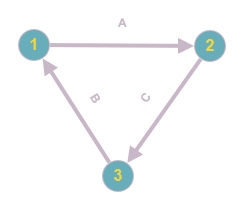
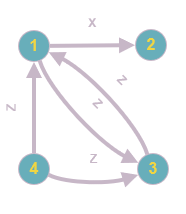
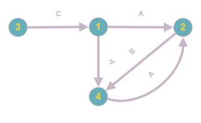

# Resolucion

Máximo Gismondi - 110119

## Ejercicio 1

### Apartado 1.A

bT1; bT2; bT3; RT1(A); WT1(A); RT2(A); WT2(A); RT3(B); WT3(B); RT1(B); WT1(B); RT2(C); WT2(C); RT3(C); WT3(C); cT1; cT2; cT3;

Linea de Tiempo:

| T1 | T2 | T3 |
|:--:|:--:|:--:|
| BG | | |
| | BG | |
| | | BG |
| R(A) | | |
| W(A) | | |
| | R(A) | |
| | W(A) | |
| | | R(B) |
| | | W(B) |
| R(B) | | |
| W(B) | | |
| | R(C) | |
| | W(C) | |
| | | R(C) |
| | | W(C) |
| CM | | |
| | CM | |
| | | CM |

Conflictos:

- T1 -> T2 por:
- RT1(A) -> WT2(A)
- WT1(A) -> RT2(A)
- WT1(A) -> WT2(A)
- T3 -> T1 por:
- RT3(C) -> WT1(B)
- WT3(C) -> RT1(B)
- WT3(C) -> WT1(B)
- T2 -> T3 por:
- RT2(A) -> WT3(B)
- WT2(A) -> RT3(B)
- WT2(A) -> WT3(B)

Grafo de precedencia:

Hay un ciclo entre T1, T2 y T3, por lo que **no es serializable**.

### Apartado 1.B

bT1; bT2; bT3; bT4; RT1(X); WT1(X); RT2(X); WT2(X); RT3(Y); WT3(Y); RT4(Z); WT4(Z); RT1(Z); RT3(Z); WT1(Z); WT3(Z); cT1; cT2; cT3; cT4;

Linea de Tiempo:

| T1 | T2 | T3 | T4 |
|:--:|:--:|:--:|:--:|
| BG | | | |
| | BG | | |
| | | BG | |
| | | | BG |
| R(X) | | | |
| W(X) | | | |
| | R(X) | | |
| | W(X) | | |
| | | R(Y) | |
| | | W(Y) | |
| | | | R(Z) |
| | | | W(Z) |
| R(Z) | | | |
| | | R(Z) | |
| W(Z) | | | |
| | | W(Z) | |
| CM | | | |
| | CM | | |
| | | CM | |
| | | | CM |

Conflictos:

- T1 -> T2 por:
- RT1(X) -> WT2(X)
- WT1(X) -> RT2(X)
- WT1(X) -> WT2(X)
- T4 -> T1 por:
- RT4(Z) -> WT1(Z)
- WT4(Z) -> RT1(Z)
- WT4(Z) -> WT1(Z)
- T4 -> T3 por:
- RT4(Z) -> WT3(Z)
- WT4(Z) -> RT3(Z)
- WT4(Z) -> WT3(Z)
- T1 -> T3 por:
- RT1(Z) -> WT3(Z)
- WT1(Z) -> RT3(Z)
- T3 -> T1 por:
- RT3(Z) -> WT1(Z)

Grafo de precedencia:

Hay un ciclo entre T3 y T1, por lo que **no es serializable**.

### Apartado 1.C

bT1; bT2; bT3; bT4; RT1(A); WT1(A); RT2(B); WT2(B); RT3(C); WT3(C); RT4(A); WT4(A); RT2(A); WT2(A); RT4(B); WT4(B); RT1(C); WT1(C); cT1; cT2; cT3; cT4;

Linea de Tiempo:

| T1 | T2 | T3 | T4 |
|:--:|:--:|:--:|:--:|
| BG | | | |
| | BG | | |
| | | BG | |
| | | | BG |
| R(A) | | | |
| W(A) | | | |
| | R(B) | | |
| | W(B) | | |
| | | R(C) | |
| | | W(C) | |
| | | | R(A) |
| | | | W(A) |
| | R(A) | | |
| | W(A) | | |
| | | | R(B) |
| | | | W(B) |
| R(C) | | | |
| W(C) | | | |
| CM | | | |
| | CM | | |
| | | CM | |
| | | | CM |

Conflictos:

- T1 -> T4 por:
- RT1(A) -> WT4(A)
- WT1(A) -> RT4(A)
- WT1(A) -> WT4(A)
- T1 -> T2 por:
- RT1(A) -> WT2(A)
- WT1(A) -> RT2(A)
- WT1(A) -> WT2(A)
- T2 -> T4 por:
- RT2(B) -> WT4(B)
- WT2(B) -> RT4(B)
- WT2(B) -> WT4(B)
- T3 -> T1 por:
- RT3(C) -> WT1(C)
- WT3(C) -> RT1(C)
- WT3(C) -> WT1(C)
- T4 -> T2 por:
- RT4(A) -> WT2(A)
- WT4(A) -> RT2(A)
- WT4(A) -> WT2(A)

Grafo de precedencia:

Hay un ciclo entre T4 y T2, por lo que **no es serializable**.

## Ejercicio 2

- T1: bT1 ; RT1(D); WT1(D); RT1(B); WT1(B); cT1
- T2: bT2 ; RT2(A); WT2(A); RT2(D); WT2(D); cT2
- T3: bT3 ; RT3(A); WT3(A); RT3(B); WT3(B); cT3

### Apartado 2.A

Colocar los locks y unlocks a las transacciones de manera de respetar 2PL, intentando minimizar el tiempo que las transacciones mantienen los locks sobre los recursos.

Para ello los aplicamos tan tarde como sea posible, y los liberamos al final de la transacción, luego de hacer el commit.

| T1 | T2 | T3 |
|:--:|:--:|:--:|
| BG | BG | BG |
| Lex(D) | Lex(A) | Lex(A) (DENIED) |
| R(D) | R(A) | |
| W(D) | W(A) | |
| Lex(B) | Lex(D) (DENIED) | |
| R(B) | | |
| W(B) | | |
| CM | | |
| U(D)| | |
| U(B)| Lex(D) | |
| | R(D) | |
| | W(D) | |
| | CM | |
| | U(A)| |
| | U(D)| Lex(A) |
| | | R(A) |
| | | W(A) |
| | | Lex(B) |
| | | R(B) |
| | | W(B) |
| | | CM |
| | | U(A)|
| | | U(B)|

### Apartado 2.B

La recuperabilidad se encarga de asegurar que tras abortar una transacción, se puede reconstruir el estado anterior e ignorar aquellos cambios que se hayan intentado hacer. Para ello, nos debemos asegurar que si una transacción Tj lee un valor que fue modificado por una transacción Ti, entonces Ti debe haber hecho commit antes de que Tj pueda hacer su respectivo commit.

Eso significa por ejemplo, si en una transacción T2 se lee un valor A que fue modificado por una transacción T1 (WT1(A)) que aún no hizo commit, entonces T2 no puede hacer commit hasta que T1 lo haga. Por otro lado, si T2 lee un valor B que fue modificado por T1 y T1 hace un abort, entonces T2 también debe abortar volviendo a un estado consistente.

En este caso el solapamiento de las transacciones T1, T2 y T3 propuesto **es recuperable**. Esto se debe dado que los conflictos del tipo WR (los que nos interesan) siempre están separados por un commit.

Por ejemplo, T1 escribe en D y luego T2 lo lee, pero T1 hace commit antes de que T2 pueda obtener el lock de D, por lo tanto se asegura que el dato de D es consistente antes de leerlo y mucho antes de hacer su respectivo commit.

De la misma forma T3 lee B luego de que T2 lo escriba y lee A luego de que T1 lo escriba, pero en ambos casos tanto T1 como T2 hacen commit antes de que T3 pueda leer de forma segura estos valores y hacer su respectivo commit.

## Ejercicio 3

Recuperar el siguiente LOG usando el método de recuperación UNDO/REDO usando checkpoints.

| Nro línea | Log |
|---------- | ---|
| 1 | START T1 |
| 2 | T1, A, 10, 50 |
| 3 | START T2 |
| 4 | T1, B, 20, 60 |
| 5 | T1, A, 50, 70 |
| 6 | T2, C, 15, 25 |
| 7 | START CKPT(T1,T2) |
| 8 | T1, B, 60, 80 |
| 9 | T2, D, 30, 40 |
| 10 | COMMIT T1 |
| 11 | T2, C, 25, 35 |
| 12 | START T3 |
| 13 | T3, E, 70, 90 |
| 14 | T2, D, 40, 60 |
| 15 | COMMIT T2 |
| 16 | T3, F, 50, 100 |
| 17 | (ignorar) |
| 18 | T3, G, 80, 120 |
| 19 | START T4 |
| 20 | T4, E, 90, 110 |
| 21 | END CKPT |
| 22 | T4, G, 120, 140 |
| 23 | COMMIT T3 |
| 24 | COMMIT T4 |

### Apartado 3.A

Justo antes de la linea 18

| Nro línea | Log |
|---------- | ---|
| 1 | START T1 |
| 2 | T1, A, 10, 50 |
| 3 | START T2 |
| 4 | T1, B, 20, 60 |
| 5 | T1, A, 50, 70 |
| 6 | T2, C, 15, 25 |
| 7 | START CKPT(T1,T2) |
| 8 | T1, B, 60, 80 |
| 9 | T2, D, 30, 40 |
| 10 | COMMIT T1 |
| 11 | T2, C, 25, 35 |
| 12 | START T3 |
| 13 | T3, E, 70, 90 |
| 14 | T2, D, 40, 60 |
| 15 | COMMIT T2 |
| 16 | T3, F, 50, 100 |
| 17 | (ignorar) |

Debemos recorre el log en reversa hasta encontrar un END CKPT y su respectivo START CKPT. De esta forma, debemos ir acumulando las transacciones que se hayan creado desde el último inicio del checkpoint junto con las transacciones que estuvieron activas en el momento de la creación.

En este caso NO hay un END CKPT antes de la linea 18, por lo que debemos ir hasta el inicio del log.

Commited transactions:

- T1
- T2

Non commited transactions:

- T3

Luego debemos hacer un UNDO de las transacciones no commited en orden inverso a su creación:

- F = 50
- E = 70

Y luego un REDO de las transacciones commited en el orden en que se crearon:

- A = 50
- B = 60
- A = 70
- C = 25
- B = 80
- D = 40
- C = 35
- D = 60

Por último debemos abortar las transacciones que no se hayan podido completar, sumando al log:

- ABORT T3

### Apartado 3.B

Justo antes de la linea 22

| Nro línea | Log |
|---------- | ---|
| 1 | START T1 |
| 2 | T1, A, 10, 50 |
| 3 | START T2 |
| 4 | T1, B, 20, 60 |
| 5 | T1, A, 50, 70 |
| 6 | T2, C, 15, 25 |
| 7 | START CKPT(T1,T2) |
| 8 | T1, B, 60, 80 |
| 9 | T2, D, 30, 40 |
| 10 | COMMIT T1 |
| 11 | T2, C, 25, 35 |
| 12 | START T3 |
| 13 | T3, E, 70, 90 |
| 14 | T2, D, 40, 60 |
| 15 | COMMIT T2 |
| 16 | T3, F, 50, 100 |
| 17 | (ignorar) |
| 18 | T3, G, 80, 120 |
| 19 | START T4 |
| 20 | T4, E, 90, 110 |
| 21 | END CKPT |

En este casp es similar, pero tenemos un END CKPT y un START CKPT antes de la linea 22. Por lo que podemos frenar en el START CKPT e ir buscando las transacciones creadas luego del START CKPT discriminando las que ya se commitearon de las que no. Esto significa que T1 y T2 ya se commitearon y se guardaron sus cambios en disco por lo que podemos ignorarlos.

Commited transactions:

Non commited transactions:

- T3
- T4

Aplicamos UNDO sobre las transacciones no commited:

- E = 90
- G = 80
- F = 50
- E = 70

Por último, abortamos las transacciones que no se hayan podido completar:

- ABORT T3
- ABORT T4

### Apartado 3.C

Justo después de la linea 22

| Nro línea | Log |
|---------- | ---|
| 1 | START T1 |
| 2 | T1, A, 10, 50 |
| 3 | START T2 |
| 4 | T1, B, 20, 60 |
| 5 | T1, A, 50, 70 |
| 6 | T2, C, 15, 25 |
| 7 | START CKPT(T1,T2) |
| 8 | T1, B, 60, 80 |
| 9 | T2, D, 30, 40 |
| 10 | COMMIT T1 |
| 11 | T2, C, 25, 35 |
| 12 | START T3 |
| 13 | T3, E, 70, 90 |
| 14 | T2, D, 40, 60 |
| 15 | COMMIT T2 |
| 16 | T3, F, 50, 100 |
| 17 | (ignorar) |
| 18 | T3, G, 80, 120 |
| 19 | START T4 |
| 20 | T4, E, 90, 110 |
| 21 | END CKPT |
| 22 | T4, G, 120, 140 |

IDEM anterior.

Commited transactions:

Non commited transactions:

- T3
- T4

Aplicamos UNDO sobre las transacciones no commited:

- G = 120
- E = 90
- G = 80
- F = 50
- E = 70

Por último, abortamos las transacciones que no se hayan podido completar:

- ABORT T3
- ABORT T4

### Resultados

| Variable | pre 18 | pre 22 | post 22 |
| :------: | :----: | :----: | :-----: |
| A | 70 | 70 | 70 |
| B | 80 | 80 | 80 |
| C | 35 | 35 | 35 |
| D | 60 | 60 | 60 |
| E | 70 | 70 | 70 |
| F | 50 | 50 | 50 |
| G | *1 | 80 | 80 |

*1 = Asumo que 80 ya que es el valor anterior según la linea 18, pero en extracto 1-17 no se debería saber.
