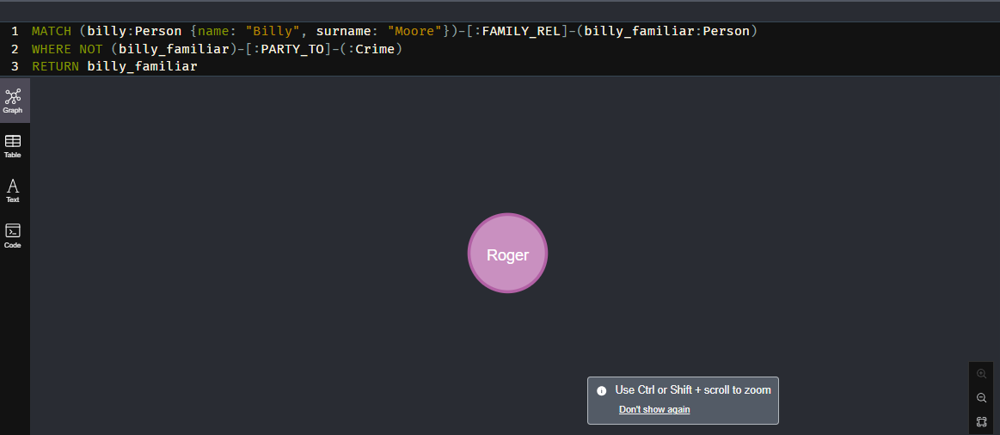
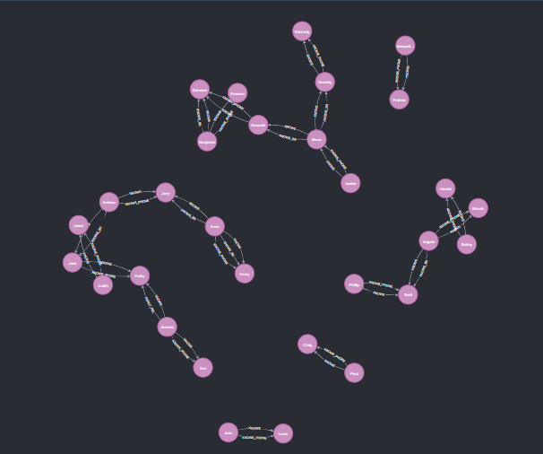

# Resolución

Máximo Gismondi - 110119

## Ejercicio 1

Para tweets que tengan 1000 o más rewteets (`retweet count`) y hayan depués de las 12 del mediodía, obtener los ids, texto y cantidad de favoritos para los 5 con más favoritos (`favorite count`).

Utilice una única consulta básica con:

```js
find(<query>, <proyeccion>).sort({}).limit(<n>)
```

```js
db.find['tweets'].find({
    retweet_count: { $gte: 1000 },
    $expr: { $gt: [{ $hour: "$created_at" }, 12] }
}).project({
    _id: 1,
    text: 1,
    favorite_count: 1,
}).sort({
    favorite_count: -1
}).limit(5)
```

## Ejercicio 2

Por cada hashtag y hora del día (00, 01, 02, ...) obtener el total de favoritos conseguidos por tweets que contengan la palabra "futbol" en el texto. Se debe indicar si se ignoraron o no los tweets que no tienen hashtags (justificar). Se debe utilizar el pipeline de agregación.

```js
db.tweets.aggregate(
    [
        {
            $match: {
                full_text: /futbol/i // Case insensitive (Futbol, futbol, FUTBOL, ...)
            }
        },
        {
            $unwind: {
                path: "$entities.hashtags",
                preserveNullAndEmptyArrays: false // Ignora los tweets que no tienen hashtags
            }
        },
        {
            $group: {
                _id: {
                    hashtag: "$entities.hashtags.text",
                    hour: {
                        $hour: "$created_at"
                    }
                },
                favorite_count: {
                    $sum: "$favorite_count"
                }
            }
        }
    ]
)
```

## Ejercicio 3

Dada la sigueinte consulta, explicar qué sucede en cada paso del pipeline y en forma resumida qué resuelve la query completa.

```js
{
    $match: {
        lang: /es|pt/,
        "place.country": "Brasil",
    },
},
```

En este primer paso, se hace el filtro de los documentos, por lenguaje y país. Se buscán aquellos con lenguaje español (es) o portugués (pt) y cuyo país de origen sea Brasil.

```js
{
    $group: {
    _id: { $ifNull: [ // coalesce 
        "$in_reply_to_status_id_str",
        "$_id",
    ]},
    tweets: { $push: {
        tweet_id: "$_id",
        text: "$full_text",
        user: "$user",
        created_at: "$created_at.date",
    }},
    avg_retweets: { $avg: "$retweet_count" },
    },
}
```

En este siguente paso, se hace el agroupamiento de los documentos, agrupando por o bien el `in_reply_to_status_id_str` o el `_id` en caso de que el primero sea nulo. Esto queire decir que se agrupan los tweets por hilo. Para cada grupo (hilo) se guarda un valor tweets que es un array de todos los tweets, el usuario que lo escribió, la fecha de creación y su contenido. Además como se segundo atributo del hilo se calcula la media de retweets en el hilo.

```js
{
    $project: {
    tweet: { $arrayElemAt: [{
        $filter: {
            input: "$tweets",
            as: "reply",
            cond: { 
                $eq: ["$$reply.tweet_id", "$_id"],
            },
        },
    }, 0 ]},
    replies: { $sortArray: { input: {
        $filter: {
        input: "$tweets",
        as: "reply",
        cond: { // eliminamos el mismo tweet
            $ne: ["$$reply.tweet_id", "$_id"],
        },
        },
    }, sortBy: {created_at: 1} } },
    avg_retweets: 1,
    },
}
```

Por último se hace la proyección. Separemos el tweet original de las respuestas y se las ordenará por fecha de creación, y se mantendrá el promedio de retweets del hilo en general.

En resumen es una consulta que busca por todos los tweets o respuestas originados en Brasil, en español o portugués, los agrupa por hilo y ordena las respuestas por fecha de creación.

## Ejercicio 4

Muestre los familiares de Billy Moore que no han tenido participación en ningún crimen.

```Cypher
MATCH (billy:Person {name: "Billy", surname: "Moore"})-[:FAMILY_REL]-(billy_familiar:Person)
WHERE NOT (billy_familiar)-[:PARTY_TO]-(:Crime)
RETURN billy_familiar
```



## Ejercicio 5

Muestre la (o las) persona(s) que ha(n) realizado mas de 7 comunicaciones telefónicas.

```Cypher
MATCH (person:Person)-[:HAS_PHONE]->(Phone)-[:CALLER|CALLED]-(call:PhoneCall)
WITH person, COUNT(call) AS calls_count
WHERE calls_count > 7
RETURN person, calls_count
```


