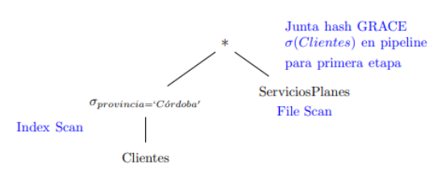

# Parcialito 6 - Costos

Máximo Gismondi - 110119

## Consigna

Una obra social posee un registro de sus clientes, el plan que cada cliente contrata, los planes disponibles y los servicios que cada plan ofrece, a través de las siguientes tablas:

- Clientes(CUIL, apellido, nombre, domicilio, CP, provincia, cod_plan) PK: {CUIL} FK: {cod_plan} -> Planes
- Planes(cod_plan, costo, descripcion) PK: {cod_plan}
- ServiciosPlanes(cod_plan, cod_servicio) PK: {cod_plan, cod_servicio} FK: {cod_plan} -> Planes

A los efectos de saber cuantos cliente de la provincia de Córdoba poseen cada sevicio, se requiere como primer paso calcular la junta entre `Clientes` y `ServiciosPlanes`. Se utilizará el método de junta hash GRACE para calcular la junta, y un índice de clustering por el atributo `provincia` para acceder a la tabla `Clientes`. Esto se resume en el siguiente plan de ejecución:



Se pide:

1. Calcular el costo del plan de ejecución en términos de cantidad de accesos a disco.
2. Estime la cardinalidad del resultado de la junta en términos de cantidad de tuplas.

Considerar par sus cálculos la siguiente información de catálogo:

Clientes:

- n(Clientes) = 2.000.000
- B(Clientes) = 200.000
- V(provincia, Clientes) = 20
- V(cod_plan, Clientes) = 200
- H(I(provincia, Clientes)) = 2

ServiciosPlanes:

- n(ServiciosPlanes) = 60.000
- B(ServiciosPlanes) = 6.000
- V(cod_plan, ServiciosPlanes) = 200

## Ejercicio 1

Para calcular el costo del plan de ejecución debemos pensar que usamos el modelo de pipeline, donde cada operación se puede ir ejecutando a medida que la otra va entregando resultados. Esto nos permite ahorrar accesos a disco, ya que no necesitamos guardar los resultados intermedios en disco sino que podemos usarlos directamente de la memoria.

Primero vamos a calcular el costo de la operación `Index Scan` sobre la tabla `Clientes`. Esto lo haremos siempre y cuando sea más barato que hacer un `File Scan`. Para esto vamos a calcular el costo de hacer un `File Scan` y compararlo con el costo de hacer un `Index Scan`.

**File Scan:**

Costo = B(Clientes) = 200.000

**Index Scan:**

Como tenemos un índice de clustering por el atributo `provincia`, el costo de hacer un `Index Scan` para la provincia de Córdoba es:

```plaintext
Costo(s_cor) = H(I(provincia, Clientes)) + ⌈B(Clientes) / V(provincia, Clientes)⌉
= 2 + ⌈200.000 / 20⌉
= 2 + 10.000
= 10.002
```

Como vemos es mucho menor que hacer un `File Scan`, por lo que vamos a usar un `Index Scan` para la tabla `Clientes`.

Podemos estimar la cardinalidad de la operación de Selección en la tabla `Clientes` para la provincia de Córdoba.

```plaintext
n(s_cor) = ⌈n(Clientes) / V(provincia, Clientes)⌉
= ⌈2.000.000 / 20⌉
= ⌈100.000⌉
= 100.000

F(Clientes) = ⌈n(Clientes) / B(Clientes)⌉
= ⌈2.000.000 / 200.000⌉
= ⌈10⌉
= 10

B(s_cor) = ⌈n(s_cor) / F(Clientes)⌉
= ⌈100.000 / 10⌉
= ⌈10.000⌉
= 10.000

F(s_cor) = ⎿ 1 / (1/F(Clientes)) ⏌

```

Ahora sabiendo esto podemos calcular el costo de la junta hash GRACE.

Para ello dado que no se especifica el tamaño de la memoria, vamos a asumir que es lo suficientemente grande para que se pueda usar el método y buscaremos los requerimientos mínimos para que esto sea posible.

Además vamos a proponer un tamaño de partición pudiendo ser este la raíz cuadrada de la cantidad de bloques de la tabla más grande, en este caso `s_cor`.

```plaintext
B(s_cor) = 10.000
B(servicios_planes) = 6.000

B(s_cor) > B(servicios_planes)

N ~ sqrt(B(s_cor)) = sqrt(10.000) = 100
```

Ahora debemos buscar el tamaño de la memoria M necesario para que se pueda usar el método de junta hash GRACE.

- Condición 1: `N < M - 1` (para que haya espacio para generar particiones) -> `100 < M - 1` -> `M > 101`
- Condición 2: `min(⌈B(s_cor)/N⌉ ; ⌈B(servicios_planes)/N⌉) < M - 2` (una vez las particiones hechas, la más pequeña debe entrar en memoria y sobrar espacio para un bloque de la tabla más grande y otro para acumular resultados) -> `min(⌈10.000/100⌉ ; ⌈6.000/100⌉) < M - 2` -> `min(100 ; 60) < M - 2` -> `60 < M - 2` -> `M > 62`
- Condición 3: `min(⌈B(s_cor)/V(cod_plan,s_cor)⌉ ; ⌈B(servicios_planes)/V(cod_plan,servicios_planes)⌉) < M - 2` (es decir que si tenemos atributos que particiones, entoces la partición pasara de ser B(X)/N a B(X)/V(A,X)) -> `min(⌈10.000/200⌉ ; ⌈6.000/200⌉) < M - 2` -> `min(50 ; 30) < M - 2` -> `30 < M - 2` -> `M > 32`

M entonces debe ser:

- M > 101
- M > 62
- M > 32

Por lo tanto M > 101.

El costo del `Hash Join` es:

```plaintext
Costo(h_join) = 2 * B(s_cor) + 3 * B(servicios_planes)
= 2 * 10.000 + 3 * 6.000
= 20.000 + 18.000
= 38.000
```

No es simplemente * 3 ya que se debe descontar el costo de la primera carga en memoria de la tabla más grande gracias al pipelining.

Finalmente el costo total del plan de ejecución es:

```plaintext
Costo_total = Costo(s_cor) + Costo(h_join)
= 10.002 + 38.000
= 48.002
```

## Ejercicio 2

```plaintext
n(junta) = n(s_cor) * n(servicios_planes) / max(V(cod_plan, s_cor), V(cod_plan, servicios_planes))
= 100.000 * 60.000 / max(200, 200)
= 6.000.000.000 / 200
= 30.000.000

F(s_cor) = F(clientes) = 10
F(servicios_planes) = ⌈n(servicios_planes) / B(servicios_planes)⌉
= ⌈60.000 / 6.000⌉
= ⌈10⌉
= 10

F(junta) = F(junta) = ⎿ 1 / (1/F(s_cor) + 1/F(servicios_planes)) ⏌
= ⎿ 1 / (1/10 + 1/10) ⏌
= ⎿ 1 / (0,1 + 0,1) ⏌
= ⎿ 1 / 0,2
= ⎿ 5 ⏌
= 5

B(junta) = ⌈n(junta) / F(junta)⌉
= ⌈30.000.000 / 5⌉
= ⌈6.000.000⌉
= 6.000.000
```
